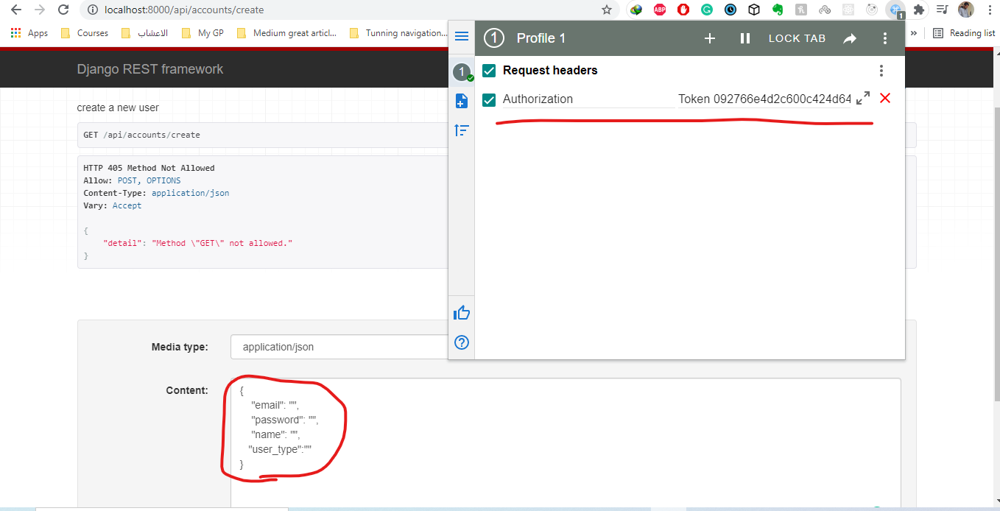

# restful API using pthon Django, Django Rest Framework 
In order to test out this project, follow these steps:

clone the repository to your local machine
# create virtual enivronment
run: python3 -m venv venv

then activate the virtual environment run in the cmd  venv\Scripts\activate

run: pip install -r requirements.txt

in task/settings.py, under DATABASES, configure your database i am using postgresql but you can use any DBMS 

# To test the project in your local host using provided unit tests:
 
 run ->  py manage.py test 
 Note : the provided test cases test all possoble cases for both accounts api and clinics api 
 
# To test the project in the browser:
complete the above step first then,
  run ->  py manage.py runserver  
go to the browser and type http://localhost:8000/api/accounts/create 
to create a new account , use Row data  instead of HTML form to provide an extra field to the backend api :
# extra field :
    "user_type":"patient"  -> to create a patient account 
                "doctor"   -> to create a doctor account 
                to create a super user account to access the django admin page , please use the command line
# after creating new account successfully 
got to    http://localhost:8000/api/accounts/token  to authenticate yourself and get the token 
after that provide the token in the comming request to backend using this extension 
https://chrome.google.com/webstore/detail/modheader/idgpnmonknjnojddfkpgkljpfnnfcklj?src=modheader 
 after installing it use request headers and provide the token this way :
  Authorization   Token token_string
  
# to edit your account data like password or user name go to :
    http://localhost:8000/api/accounts/me 

# Note :
  doctors can not access patients api endpoint and vice versa

# use the clinics api 
# 1. doctors 
  go to   http://localhost:8000/api/clinics/doctors  to list all doctor clinics reservation 
  Note: you must use an authenticated doctor account to access this api 
# 2. patients 
    Note: you must use an authenticated patient account to access this api 
    All CRUD operations are provided (list, create, delete, update both put and patch)
    A. go to http://localhost:8000/api/clinics/patients  -> for both listing reserved clincis and creating new ones 
    B. go to http://localhost:8000/api/clinics/patients/pk/ -> for update/delete reserved clinics 

